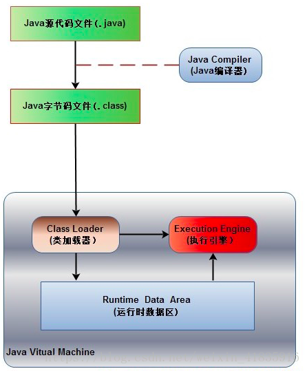
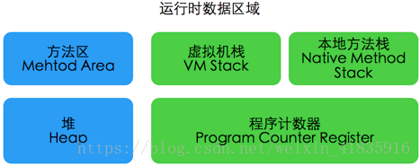

# Java内存模型

## 1.java程序执行过程:

>Java源代码文件(.java后缀)会被Java编译器编译为字节码文件(.class后缀)，然后由JVM中的类加载器加载各个类的字节码文件，加载完毕之后，交由JVM执行引擎执行。在整个程序执行过程中，JVM会用一段空间来存储程序执行期间需要用到的数据和相关信息，这段空间一般被称作为Runtime Data Area（运行时数据区），也就是我们常说的JVM内存。因此，在Java中我们常常说到的内存管理就是针对这段空间进行管理（如何分配和回收内存空间）。

## 2.运行时数据区包括哪几部分：

### 2.1 方法区（Method Area）
- 方法区是各个线程共享的内存区域，它用于存储已被虚拟机加载的**类信息、常量、静态变量、即时编译器编译后的代码等数据**。当方法区无法满足内存分配需求时，将抛出OutOfMemoryError 异常。
- 方法区里存放着类的版本，字段，方法，接口和常量池。常量池里存储着字面量和符号引用。符号引用包括：
	- 1.类的全限定名
	- 2.字段名和属性
	- 3.方法名和属性。

### 2.2 JVM堆（Java Heap）
- Java 堆也是属于线程共享的内存区域，它在虚拟机启动时创建，是Java 虚拟机所管理的内存中最大的一块，主要用于存放**对象实例**，几乎所有的对象实例都在这里分配内存，注意Java 堆是垃圾收集器管理的主要区域，因此很多时候也被称做GC堆，如果在堆中没有内存完成实例分配，并且堆也无法再扩展时，将会抛出OutOfMemoryError 异常。

### 2.3 程序计数器(Program Counter Register)：
- 字节码解释器工作时，**通过改变这个计数器的值来选取下一条需要执行的字节码指令**，分支、循环、跳转、异常处理、线程恢复等基础功能都需要依赖这个计数器来完成。
- 多线程中，为了让线程切换后能恢复到正确的执行  位置，每条线程都需要有一个独立的程序计数器，各条线程之间互不影响、独立存储，因此这块内存是**线程私有**的。

### 2.4 虚拟机栈(Java Virtual Machine Stacks)：
- Java虚拟机栈也是**线程私有**的，它的生命周期与线程相同。虚拟机栈描述的是Java方法执行的内存模型：每个方法在执行的同时都会创建一个栈帧用于存储**局部变量表**、操作数栈、动态链表、**方法出口**信息等。**每一个方法从调用直至执行完成的过程，就对应着一个栈帧在虚拟机栈中入栈到出栈的过程**。

### 2.5 本地方法栈(Native Method Stacks)：
- 本地方法栈属于**线程私有**的数据区域，这部分主要与虚拟机用到的 **Native 方法**相关，一般情况下，我们无需关心此区域。

参考：<http://blog.csdn.net/javazejian/article/details/72772461>
