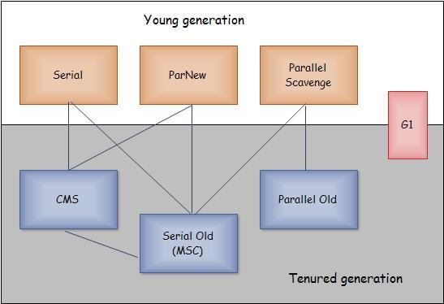

# 垃圾回收器

### 基础概念
1、并发和并行
- a：并行（Parallel）：指多条垃圾收集线程并行工作，但此时用户线程仍然处于等待状态。
- b：并发（Concurrent）：指用户线程与垃圾收集线程同时执行（但不一定是并行的，可能会交替执行），用户程序在继续运行，而垃圾收集程序运行在另一个CPU上。

2、新生代 GC 和老年代GC
- a:新生代GC（Minor GC）：指发生在新生代的垃圾收集动作，因为Java对象大多都具备朝生夕灭的特性，所以Minor GC非常频繁，一般回收速度也比较快。
- b:老年代GC（Major GC / Full GC）：指发生在老年代的GC，出现了Major GC，经常会伴随至少一次的Minor GC（但非绝对的）。Major GC的速度一般会比Minor GC慢10倍以上。

3、吞吐量
- 吞吐量就是CPU用于运行用户代码的时间与CPU总消耗时间的比值，即吞吐量 = 运行用户代码时间 /（运行用户代码时间 + 垃圾收集时间）。

>虚拟机总共运行了100分钟，其中垃圾收集花掉1分钟，那吞吐量就是99%。

### 垃圾收集器
- Serial收集器
	- 新生代、老年代使用串行回收；新生代复制算法、老年代标记-压缩;收集过程中服务会暂停。
	- 参数控制：-XX:+UseSerialGC 串行收集器
- ParNew收集器
	- 新生代并行，老年代串行；新生代复制算法、老年代标记-压缩；ParNew收集器其实就是Serial收集器的多线程版本。
	- 参数控制：
		- -XX:+UseParNewGC ParNew收集器
    	- -XX:ParallelGCThreads 限制线程数量

- Parallel Scavenge收集器
	- 新生代复制算法。老年代标记压缩，串行
	- 参数控制：-XX:+UseParallelGC
	
- Serial Old收集器
	- 它是Serial收集器的老年代版，它同样是一个单线程收集器，使用“标记--整理”算法。	

- Parallel Old 收集器
	- 是Parallel Scavenge收集器的老年代版，使用多线程与“标记--整理”算法。
	
- CMS收集器
	- 基于**标记清除**（缺点会生成大量空间碎片）	
	- 是一种以获取最短回收停顿时间为目标的收集器。目前很大一部分的java应用集中在互联网站或者B/S系统的服务端上，这类应用尤其重视服务的响应速度，希望系统停顿时间最短，以给用户带来较好的体验	
	- CMS垃圾收集器执行过程
      a、初始标记（CMS inital mark）：需要“stop the world”，但只标记一下GC Roots能直接关联的对象，速度很快。

      b、并发标记（CMS concurrent mark）：是GC Roots Tracing的过程，花费时间长

      c、重新标记（CMS remark）：是为了修正并发标记期间因用户程序继续运行而导致标记产生变动的那一部分对象的标记记录，这个阶段时间一般会比初始标记阶段稍长一些，但远比并发标记的时间短。

      d、并发清除（CMS concurrent sweep）：是并发清除无用对象。

- G1收集器（Garbage-First）
	- 基于**标记—整理**(优点没有大量垃圾空间碎片)
	- G1垃圾收集器执行过程
	- a、初始标记（Initial Marking）
	初始标记阶段仅仅只是标记一下GC Roots能直接关联到的对象，并且修改TAMS的值，让下一阶段用户程序并发运行时，能在正确可用的Region中创建新对象，这阶段需要停顿线程，但耗时很短。

	b、并发标记（Concurrent Marking）

	并发标记阶段是从GC Root开始对堆中对象进行可达性分析，找出存活的对象，这阶段耗时较长，但可与用户程序并发执行。

	c、最终标记（Final Marking）

	最终标记阶段是为了修正在并发标记期间因用户程序继续运作而导致标记产生变动的那一部分标记记录，虚拟机将这段时间对象变化记录在线程Remembered Set Logs里面，最终标记阶段需要把Remembered Set

	Logs的数据合并到Remembered Set中，这阶段需要停顿线程，但是可并行执行。

	d、筛选回收（Live Data Counting and Evacuation）

	筛选回收阶段首先对各个Region的回收价值和成本进行排序，根据用户所期望的GC停顿时间来制定回收计划，这个阶段其实也可以做到与用户程序一起并发执行，但是因为只回收一部分Region，时间是用户可控制的，而且停顿用户线程将大幅提高收集效率。

### 常用组合

参考：<https://www.cnblogs.com/qdhxhz/p/9211269.html>
