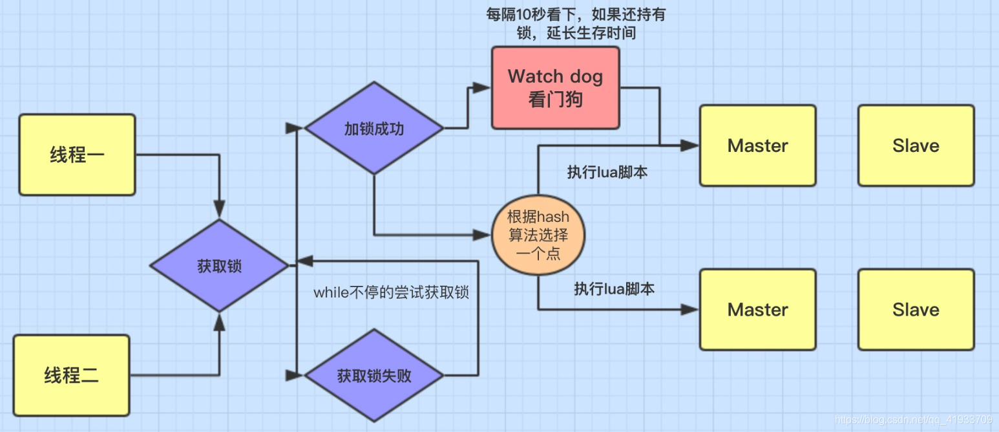

## 1.Redis简单介绍
-  语言开发的内存数据库，除了做KV缓存外还能做分布式锁、延时队列、定时任务等等

## 2.缓存读写模式/更新策略/处理流程
- Cache Aside Pattern（旁路缓存模式）
- Read/Write Through Pattern（读写穿透）
- Write Behind Pattern（异步缓存写入）

## 3.为什么要用 Redis/为什么要用缓存？
- 简单来说使用缓存主要是为了提高接口响应速度，提升用户体验以及应对更多的用户。
- 高性能：对于高频数据并且不会经常改变的数据，保证下一次用户访问的数据直接从缓存中读取。
- 高并发：数据库的 QPS 大概都在 1w 左右（4 核 8g） ，但是使用 Redis 缓存之后很容易达到 10w+，
	> QPS（Query Per Second）：服务器每秒可以执行的查询次数；

## 4.Redis 常见数据结构以及使用场景分析
### 4.1 String
- 普通操作：
```
127.0.0.1:6379> set key value #设置 key-value 类型的值
OK
127.0.0.1:6379> get key # 根据 key 获得对应的 value
"value"
127.0.0.1:6379> exists key  # 判断某个 key 是否存在
(integer) 1
127.0.0.1:6379> strlen key # 返回 key 所储存的字符串值的长度。
(integer) 5
127.0.0.1:6379> del key # 删除某个 key 对应的值
(integer) 1
127.0.0.1:6379> get key
(nil)
```

### 4.2 list
### 4.3 hash
### 4.4 set
### 4.5 sorted set

## 5 redis缓存过期时间有什么用？
- 内存是有限的，如果缓存中的所有数据都是一直保存的话可能会OOM。
- 有些业务场景需要某个数据只在某一时间段内存在，比如短信验证码可能只在1分钟内有效，用户登录的 token 可能只在 1 天内有效。
> 如果使用传统的数据库来处理的话，一般都是自己判断过期，这样更麻烦并且性能要差很多。
> ```
127.0.0.1:6379> expire key  60 # 数据在 60s 后过期
(integer) 1
127.0.0.1:6379> setex key 60 value # 数据在 60s 后过期 (setex:[set] + [ex]pire)
OK
127.0.0.1:6379> ttl key # 查看数据还有多久过期
(integer) 56
> ```

## 6.Redis如何判断数据过期？
- Redis 通过一个叫做过期字典（可以看作是hash表）来保存数据过期的时间。过期字典的键指向Redis数据库中的某个key(键)，过期字典的值是一个long long类型的整数，这个整数保存了key所指向的数据库键的过期时间（毫秒精度的UNIX时间戳）。

## 7.过期的数据的删除策略了解么？
- 如果假设你设置了一批 key 只能存活 1 分钟，那么 1 分钟后，Redis 是怎么对这批 key 进行删除的呢？
> 常用的过期数据的删除策略就两个
	- 1.惰性删除 ：只会在取出key的时候才对数据进行过期检查。这样对CPU最友好，但是可能会造成太多过期 key 没有被删除。
    - 2.定期删除 ： 每隔一段时间抽取一批 key 执行删除过期key操作。并且，Redis 底层会通过限制删除操作执行的时长和频率来减少删除操作对CPU时间的影响。
	- 定期删除对内存更加友好，惰性删除对CPU更加友好。
>   - 但是，仅仅通过给 key 设置过期时间还是有问题的。因为还是可能存在定期删除和惰性删除漏掉了很多过期 key 的情况。这样就导致大量过期 key 堆积在内存里，然后就Out of memory了。如何解决**Redis 内存淘汰机制。**

## 8.Redis 内存淘汰机制了解么？
> 相关问题：MySQL 里有 2000w 数据，Redis 中只存 20w 的数据，如何保证 Redis 中的数据都是热点数据?

- Redis 提供 6 种数据淘汰策略：
	1. volatile-lru（least recently used）：从已设置过期时间的数据集（server.db[i].expires）中挑选最近最少使用的数据淘汰
    2. volatile-ttl：从已设置过期时间的数据集（server.db[i].expires）中挑选将要过期的数据淘汰
    3. volatile-random：从已设置过期时间的数据集（server.db[i].expires）中任意选择数据淘汰
    4. allkeys-lru（least recently used）：当内存不足以容纳新写入数据时，在键空间中，移除最近最少使用的 key（这个是最常用的）
    5. allkeys-random：从数据集（server.db[i].dict）中任意选择数据淘汰
    6. no-eviction：禁止驱逐数据，也就是说当内存不足以容纳新写入数据时，新写入操作会报错。这个应该没人使用吧！

- 4.0 版本后增加以下 2 种：
    7. volatile-lfu（least frequently used）：从已设置过期时间的数据集(server.db[i].expires)中挑选最不经常使用的数据淘汰
    8. allkeys-lfu（least frequently used）：当内存不足以容纳新写入数据时，在键空间中，移除最不经常使用的 key

## 9.Redis 持久化机制(怎么保证 Redis 挂掉之后再重启数据可以进行恢复)
- 快照（snapshotting）持久化（RDB）
>快照持久化是 Redis 默认采用的持久化方式，在 Redis.conf 配置文件中默认有此下配置：
>```
>save 900 1           #在900秒(15分钟)之后，如果至少有1个key发生变化，Redis就会自动触发BGSAVE命令创建快照。
>save 300 10          #在300秒(5分钟)之后，如果至少有10个key发生变化，Redis就会自动触发BGSAVE命令创建快照。
>save 60 10000        #在60秒(1分钟)之后，如果至少有10000个key发生变化，Redis就会自动触发BGSAVE命令创建快照。
>
```

- AOF（append-only file）持久化
> 与快照持久化相比，AOF 持久化 的实时性更好，因此已成为主流的持久化方案。默认情况下 Redis 没有开启 AOF（append only file）方式的持久化，可以通过 appendonly 参数开启：
> ```
> appendonly yes
> ```
> 在 Redis 的配置文件中存在三种不同的 AOF 持久化方式，它们分别是：
> ```
>appendfsync always    #每次有数据修改发生时都会写入AOF文件,这样会严重降低Redis的速度
>appendfsync everysec  #每秒钟同步一次，显示地将多个写命令同步到硬盘，（兼顾数据和写入性能的最优解）
>appendfsync no        #让操作系统决定何时进行同步
>```

## 10.Redis事务
- Redis 的事务和我们平时理解的关系型数据库的事务不同。我们知道事务具有四大特性： 1. 原子性，2. 隔离性，3. 持久性，4. 一致性。
- Redis 是不支持 roll back 的，因而不满足原子性的（而且不满足持久性）
- Redis开发者觉得即使命令执行错误也应该在开发过程中就被发现而不是生产过程中。
- 可以将Redis中的事务就理解为 ：Redis事务提供了一种将多个命令请求打包的功能。然后，再按顺序执行打包的所有命令，并且不会被中途打断。

## 11.缓存穿透
- 缓存穿透是什么？
大量请求的 key 根本不存在于缓存中，导致请求直接到了数据库上，根本没有经过缓存这一层。
导致所有请求最终都要跑到数据库中查询一遍。
- 解决办法？
	- 缓存无效key
	这种方式可以解决请求的 key 变化不频繁的情况，如果黑客恶意攻击，每次构建不同的请求 key，会导致 Redis 中缓存大量无效的 key 。
	- 布隆过滤器
	通过布隆过滤器我们可以非常方便地判断一个给定数据是否存在于海量数据中
	把所有可能存在的请求的值都存放在布隆过滤器中，当用户请求过来，先判断用户发来的请求的值是否存在于布隆过滤器中。不存在的话，直接返回请求参数错误信息给客户端，存在的话才会走下面的流程。
>**布隆过滤器可能会存在误判的情况:布隆过滤器说某个元素存在，小概率会误判。布隆过滤器说某个元素不在，那么这个元素一定不在。**

>为什么会出现误判的情况呢? 我们还要从布隆过滤器的原理来说！

>我们先来看一下，当一个元素加入布隆过滤器中的时候，会进行哪些操作：

>使用布隆过滤器中的哈希函数对元素值进行计算，得到哈希值（有几个哈希函数得到几个哈希值）。
根据得到的哈希值，在位数组中把对应下标的值置为 1。
我们再来看一下，当我们需要判断一个元素是否存在于布隆过滤器的时候，会进行哪些操作：

>对给定元素再次进行相同的哈希计算；
>得到值之后判断位数组中的每个元素是否都为 1，如果值都为 1，那么说明这个值在布隆过滤器中，如果存在一个值不为 1，说明该元素不在布隆过滤器中。
>然后，一定会出现这样一种情况：不同的字符串可能哈希出来的位置相同。 （可以适当增加位数组大小或者调整我们的哈希函数来降低概率）


## 12.缓存雪崩
缓存雪崩：有一些被大量访问数据（热点缓存）在某一时刻大面积失效，导致对应的请求直接落到了数据库上。
解决办法：
	- Redis集群，避免单机出现问题整个缓存服务都没办法使用
	- 限流，避免同时处理大量的请求。


## 13.如何保证缓存和数据库数据的一致性？
**涉及到缓存更新策略/读写模式/处理流程**
- Cache Aside Pattern（旁路缓存模式）
	- 读：从 cache 中读取数据，读取到就直接返回 。读取不到的话，先从 DB 加载，写入到 cache 后返回响应。
	- 写：**更新 DB，然后直接删除 cache 。**
- Read/Write Through Pattern（读写穿透）
	- 读：从 cache 中读取数据，读取到就直接返回 。读取不到的话，先从 DB 加载，写入到 cache 后返回响应。
	- 写：**先查 cache，cache 中不存在，直接更新 DB。 cache 中存在，则先更新 cache，然后 cache 服务自己更新 DB（同步更新 cache 和 DB）。**
- Write Behind Pattern（异步缓存写入）
	- 读：从 cache 中读取数据，读取到就直接返回 。读取不到的话，先从 DB 加载，写入到 cache 后返回响应。
	- 写：**无论是否存在，都直接跟新缓存，最好异步批量的方式来更新 DB。**

## 14.Redis是否支持ACID?
Redis 具备了一定的原子性，但不支持回滚。
Redis 不具备 ACID 中一致性的概念。(或者说 Redis 在设计时就无视这点)
Redis 具备隔离性。(Redis 为单线程操作)
Redis 通过(AOF、RDB)可以保证持久性。

## 15.Redis分布式锁
1.用jedis手撸分布式锁
用SETNX key value
将 key 的值设为 value ，当且仅当 key 不存在。
若给定的 key 已经存在，则 SETNX 不做任何动作。
SETNX 是『SET if Not eXists』(如果不存在，则 SET)的简写。
返回值：
设置成功，返回 1 。
设置失败，返回 0 。


2.采用Redission框架实现
原理

1、加锁机制

线程去获取锁，获取成功: 执行lua脚本，保存数据到redis数据库。
线程去获取锁，获取失败: 一直通过while循环尝试获取锁，获取成功后，执行lua脚本，保存数据到redis数据库。

2、watch dog自动延期机制（性能较差）
在一个分布式环境下，假如一个线程获得锁后，突然服务器宕机了，那么这个时候在一定时间后这个锁会自动释放，你也可以设置锁的有效时间(不设置默认30秒），这样的目的主要是防止死锁的发生。

3、使用lua脚本
通过封装在lua脚本中发送给redis，而且redis是单线程的，这样就保证这段复杂业务逻辑执行的原子性。

#### Redis分布式锁的缺点
Redis分布式锁会有个缺陷，就是在Redis哨兵模式下:
客户端1 对某个master节点写入了redisson锁，此时会异步复制给对应的 slave节点。但是这个过程中一旦发生 master节点宕机，主备切换，slave节点从变为了 master节点。
这时客户端2 来尝试加锁的时候，在新的master节点上也能加锁，此时就会导致多个客户端对同一个分布式锁完成了加锁。
这时系统在业务语义上一定会出现问题，导致各种脏数据的产生。
缺陷在哨兵模式或者主从模式下，如果 master实例宕机的时候，可能导致多个客户端同时完成加锁。


```java
获取方式： 
final RedissonClient client = Redisson.create(config);  
RLock lock = client.getLock("lock1");
解锁：
lock.unlock();
```
代码参考：https://gitee.com/love_yu_0698


refer to:<https://blog.csdn.net/qq_41933709/article/details/106456920>