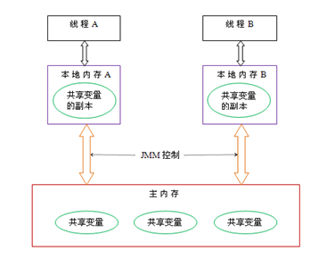

## 并发编程3个重要特性
并发编程的三个重要特性**原子性、可见性、有序性**

- 原子性
即一个操作或者多个操作 要么全部执行并且执行的过程不会被任何因素打断，要么就都不执行。
- 可见性
可见性是指当多个线程访问同一个变量时，一个线程修改了这个变量的值，其他线程能够立即看得到修改的值。
- 有序性
即程序执行的顺序按照代码的先后顺序执行。
>```java
int a = 10;
int b = 5;
>```


在Java内存模型中，允许编译器和处理器对指令进行重排序，但是重排序过程不会影响到单线程程序的执行，却会影响到多线程并发执行的正确性。

ps:要想并发程序正确地执行，必须要保证原子性、可见性以及有序性。只要有一个没有被保证，就有可能会导致程序运行不正确。

## volatile

**volatile语义**
- 1）**保证了不同线程对这个变量进行操作时的可见性，即一个线程修改了某个变量的值，这新值对其他线程来说是立即可见的。（保证变量的可见性）**
- 2）**禁止进行指令重排序。(保证有序性)**


**为什么不保证原子性：**<font color = 'red'>volatile修饰的属性若再修改前被另一个线程读取了值，那么修改后，无法改变已经复制到工作内存中的值。</font>


```java
volatile static int a=0;
a++;

// 包含了2步操作：1、读取a。2、执行a+1 & 将a+1结果赋值给a

// 设：线程A、B同时执行以下语句，线程A执行完第1步后被挂起、线程B执行了a++，那么主存中a的值为1

// 但线程A的工作内存中还是0，由于线程A之前已读取了a的值 = 0，执行a++后再次将a的值刷新到主存 = 1

// 即 a++执行了2次，但2次都是从0变为1，故a的值最终为1
```


通过上图可知：
Java内存模型规定所有的变量都是存在主存当中，每个线程都有自己的工作内存。线程对变量的所有操作都必须在自己的工作内存中进行，而不能直接对主存进行操作。并且每个线程不能访问其他线程的工作内存。
Java内存模型只保证了基本读取和赋值是原子性操作。


**为什么保证可见性：**
- volatile修饰的属性能够保证每次读取都是最新的值
- 但在多线程下不会也无法更新已经读取了的值

>(1)对于普通的成员变量不能保证可见性，因为普通共享变量被修改之后，什么时候被写入主存是不确定的，当其他线程去读取时，此时内存中可能还是原来的旧值，因此无法保证可见性。
>(2)当一个共享变量被volatile修饰时，它会保证修改的值会立即被更新到主存，当有其他线程需要读取时，它会去内存中读取新值。

**为什么保证有序性**重排序时，以volatile修饰的属性的读/写操作代码为分界线（lock前缀指令），读/写操作前的代码不允许排到后面，后面不允许排到前面，由此保证有序性。

**使用条件：**
您只能在有限的一些情形下使用 volatile 变量替代锁。要使 volatile 变量提供理想的线程安全，必须同时满足下面两个条件：
- 对变量的写操作不依赖于当前值。
- 该变量没有包含在具有其他变量的不变式中。


**使用场景：**

- 模式 #1：状态标志

```java
volatile boolean shutdownRequested;
 
...
 
public void shutdown() { 
    shutdownRequested = true; 
}
 
public void doWork() { 
    while (!shutdownRequested) { 
        // do stuff
    }
}

```

- 模式 #2：双重检查锁单例模式

```java
public class Singleton {  
    private volatile static Singleton singleton;  
    private Singleton (){}  
    public static Singleton getSingleton() {  
    if (singleton == null) {  
        synchronized (Singleton.class) {  
        if (singleton == null) {  
            singleton = new Singleton();  
        }  
        }  
    }  
    return singleton;  
    }  
}

```

- 模式 #3：开销较低的“读－写锁”策略

```java
 
public class CheesyCounter {  
    // Employs the cheap read-write lock trick  
    // All mutative operations MUST be done with the 'this' lock held  
    private volatile int value;  
  
    //读操作，没有synchronized，提高性能  
    public int getValue() {   
        return value;   
    }   
  
    //写操作，必须synchronized。因为x++不是原子操作  
    public synchronized int increment() {  
        return value++;  
    } 
}
```

### 总结
- （1）对于普通成员变量它只保证了基本读取和赋值是原子性操作、它无法保证可见性、它会产生重排序。
- （2）使用volatile关键字能保证可见性，和一定的有序性。而使用synchronized和Lock能保证原子性、可见性、有序性。


refer to: http://www.sohu.com/a/281007804_100212268
refer to: https://blog.csdn.net/vking_wang/article/details/9982709
refer to: https://www.runoob.com/design-pattern/singleton-pattern.html


