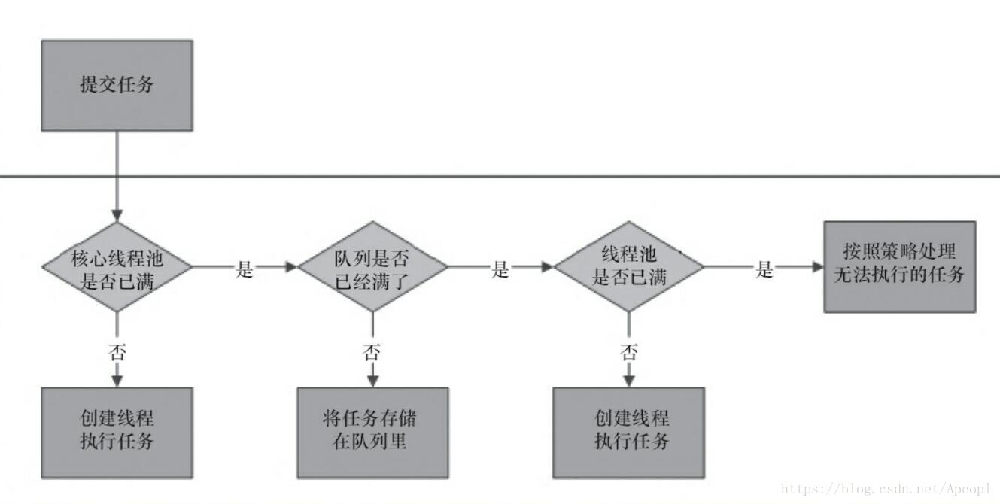

## 1.创建线程的三种方式

- (1)继承thread,重写run方法
- (2)实现Runnable接口，实现run方法
- (3)实现Callable接口，实现call方法
- (4)线程池

## 2.Runnable和Callable的区别：
- (1)Callable实现的方法是call(),Runnable实现的方法是run().
- (2)Callable的任务执行后可返回值，可以拿到一个Future对象，而Runnable的任务没有返回值
- (3)call方法需要抛出异常InterruptedException和ExecutionExecption，run方法只能在内部消化InterruptedException

## 3.Thread的缺点：
- Java是单继承多实现，不利于扩展.

## 4. 线程池
### 4.1 为什么要使用线程池
- **降低资源消耗。** 通过重复利用已创建的线程降低线程创建和销毁造成的消耗。
- **提高响应速度。** 当任务到达时，任务可以不需要的等到线程创建就能立即执行。
- **提高线程的可管理性。** 线程是稀缺资源，如果无限制的创建，不仅会消耗系统资源，还会降低系统的稳定性，使用线程池可以进行统一的分配，调优和监控。

### 4.2 execute()和submit()的区别
- (1)可接受任务类型：
	- submit:
```java
submit(Callable<T> task):Future<T> -ExecutorService
submit(Runnable task):Future<?> -ExecutorService
submit(Runnable task,T result):Future<T> -ExecutorService
```
	- execute:
```java
execute(Runnable command):void -Executor
```
	- 从源码种可以看出
		- execute只能接受Runnable类型的任务
		- submit不管是Runnable还是Callable类型的任务都可以接受
- (2)返回值
	- 由Callable和Runnable的区别可以看出：
		- execute没有返回值
		- submit有返回值，所以需要返回值的时候必须使用submit
- (3)异常处理
	- submit在执行过程中与execute不一样，不会抛出异常而是把异常保存在成员变量中，在FutureTask.get阻塞获取的时候再把异常抛出来。
	
	-  execute中抛出异常
	   execute中的是Runnable接口的实现，所以只能使用try、catch来捕获CheckedException，通过实现UncaughtExceptionHande接口处理UncheckedException
即和普通线程的处理方式完全一致

    - submit中抛出异常
       不管提交的是Runnable还是Callable类型的任务，如果不对返回值Future调用get()方法，异常都不会被抛出

callable接口
```java
    public interface Callable<V> {
        V call() throws Exception;
    }
```
示例代码：
```java
    Runnable r = new Runnable() {
        @Override
        public void run() {
            System.out.println(1);
        }
    };
    
    Callable<Integer> c= new Callable<Integer>() {
        @Override
        public Integer call() throws Exception {
            return 1;
       }
    };
    //lambda写法
    Runnable r2 = () -> System.out.println(1);
    Callable<Integer> c= () -> 1;

    ExecutorService executorService = Executors.newFixedThreadPool(1);
    executorService.execute(r);
    executorService.submit(r);

    Future<?> runnableResult = executorService.submit(r);
    try {
        runnableResult.get();
    } catch (InterruptedException e) {
        e.printStackTrace();
    } catch (ExecutionException e) {
        e.printStackTrace();
    }

    Future<Integer> callResult  = executorService.submit(c);
    try {
        callResult.get();
    } catch (InterruptedException e) {
        e.printStackTrace();
    } catch (ExecutionException e) {
        e.printStackTrace();
    }
```
所以在future.get()方法中要显式捕获InterruptedException和ExecutionExecption


TIPS:

- **线程资源必须通过线程池提供，不允许在应用中自行显式创建线程**   
  使用线程池的好处是减少在创建和销毁线程上所消耗的时间以及系统资源的开销，解决
资源不足的问题。如果不使用线程池，有可能造成系统创建大量同类线程而导致消耗完内存或 者“过度切换”的问题。
- **线程池不允许使用 Executors 去创建，而是通过 ThreadPoolExecutor 的方式，这样 的处理方式让写的同学更加明确线程池的运行规则，规避资源耗尽的风险。**   
  说明：Executors 返回的线程池对象的弊端如下： 
	- 1）FixedThreadPool 和 SingleThreadPool:   
		- 允许的请求队列长度为 Integer.MAX_VALUE，可能会堆积大量的请求，从而导致 OOM。 
	- 2）CachedThreadPool 和 ScheduledThreadPool:   
		- 允许的创建线程数量为 Integer.MAX_VALUE，可能会创建大量的线程，从而导致 OOM。


**Executor：**
是一个接口，定义了一个接受Runnable参数的execute方法
```
public interface Executor {
    void execute(Runnable command);
}
```


**Executors：**
Executors类，提供了一系列工厂方法用于创建线程池，返回的线程池都实现了ExecutorService接口。

1. public static ExecutorService newFiexedThreadPool(int Threads) 创建固定数目线程的线程池。
2. public static ExecutorService newCachedThreadPool()：创建一个可缓存的线程池，调用execute 将重用以前构造的线程（如果线程可用）。如果没有可用的线程，则创建一个新线程并添加到池中。终止并从缓存中移除那些已有 60 秒钟未被使用的线程。
3. public static ExecutorService newSingleThreadExecutor()：创建一个单线程化的Executor。
4. public static ScheduledExecutorService newScheduledThreadPool(int corePoolSize)

**ExecutorService：**
除了允许客户端提交一个任务，ExecutorService 还提供用来控制线程池的方法。
　　   　　比如：调用 shutDown() 方法终止线程池。
**ExecutorService是一个比Executor使用更广泛的子类接口**，其提供了生命周期管理的方法，**返回 Future 对象**，以及可跟踪一个或多个异步任务执行状况返回Future的方法；可以调用ExecutorService的shutdown（）方法来平滑地关闭 ExecutorService，调用该方法后，将导致ExecutorService**停止接受任何新的任务且等待已经提交的任务执行完成**(已经提交的任务会分两类：一类是已经在执行的，另一类是还没有开始执行的)，当所有已经提交的任务执行完毕后将会关闭ExecutorService。因此我们一般用该接口来实现和管理多线程。
```java

public interface ExecutorService extends Executor {
	void shutdown();
	<T> Future<T> submit(Callable<T> task);
	<T> Future<T> submit(Runnable task, T result);
	<T> List<Future<T>> invokeAll(Collection<? extends Callable<T>> tasks, long timeout, TimeUnit unit) throws InterruptedException;
}

```

**自定义与预定义线程池**

1. ThreadPoolExecutor最核心的构造方法  

| - | 名称             | 类型                     | 作用                 |
|---| ---              | ---                     | ---                  |
| 1 | corePoolSize	   |int                      | 核心线程池大小        |
| 2 | maximumPoolSize  | int                     | 最大线程池大小        |
| 3 | keepAliveTime	   | long                    | 线程最大空闲时间，**线程池中超过corePoolSize数目的空闲线程最大存活时间；**可以allowCoreThreadTimeOut(true)使得核心线程有效时间 |
| 4 | TimeUnit	       | TimeUnit                | keepAliveTime时间单位 |
| 5 | workQueue	       | BlockingQueue<Runnable> | 线程等待队列          |
| 6 | threadFactory	   | ThreadFactory           | 线程创建工厂          |
| 7 | RejectedExecutionHandler | RejectedExecutionHandler |拒绝策略，提交任务数超过maxmumPoolSize+workQueue之和时，任务会交给RejectedExecutionHandler来处理 |


- ThreadPoolExecutor类中有几个非常重要的方法
	- execute()
	- submit()
		- submit()方法的实现，会发现它实际上还是调用的execute()方法，只不过它利用了Future来获取任务执行结果。
	- shutdown()
		- shutdown()方法，则线程池处于SHUTDOWN状态，此时线程池不能够接受新的任务，它会等待所有任务执行完毕。
	- shutdownNow()
		- shutdownNow()方法，则线程池处于STOP状态，此时线程池不能接受新的任务，并且会去尝试终止正在执行的任务。
- 3种阻塞队列 
	- BlockingQueue是接口，用来存储runnable对象    

阻塞队列的成员

|队列	                |有界性	           | 锁	|数据结构    |
| ---                   | ---              | ---| ---       |
|ArrayBlockingQueue	    |bounded(有界)	   |加锁	|arrayList  |
|LinkedBlockingQueue	|optionally-bounded|加锁	|linkedList |
|PriorityBlockingQueue	|unbounded	       |加锁	|heap       |
|DelayQueue	            |unbounded	       |加锁	|heap       |
|SynchronousQueue	    |bounded	       |加锁	|无         |
|LinkedTransferQueue	|unbounded	       |加锁	|heap       |
|LinkedBlockingDeque	|unbounded	       |无锁	|heap       |

- 队列详解
	- <font color = 'red'>**ArrayBlockingQueue**</font>：【基于数组的先进先出队列,有界】是一个用数组实现的有界阻塞队列，此队列按照先进先出（FIFO）的原则对元素进行排序。支持公平锁和非公平锁。【注：每一个线程在获取锁的时候可能都会排队等待，如果在等待时间上，先获取锁的线程的请求一定先被满足，那么这个锁就是公平的。反之，这个锁就是不公平的。公平的获取锁，也就是当前等待时间最长的线程先获取锁】
	- <font color = 'red'>**LinkedBlockingQueue**</font>：【基于链表的先进先出队列,无界】一个由链表结构组成的有界队列，此队列的长度为Integer.MAX_VALUE。此队列按照先进先出（FIFO）的顺序进行排序。
	- **PriorityBlockingQueue**： 一个支持线程优先级排序的无界队列，默认自然序进行排序，也可以自定义实现compareTo()方法来指定元素排序规则，不能保证同优先级元素的顺序。
	- <font color = 'red'>**DelayQueue**</font>： 一个实现PriorityBlockingQueue实现延迟获取的无界队列，在创建元素时，可以指定多久才能从队列中获取当前元素。只有延时期满后才能从队列中获取元素。（DelayQueue可以运用在以下应用场景：1.缓存系统的设计：可以用DelayQueue保存缓存元素的有效期，使用一个线程循环查询DelayQueue，一旦能从DelayQueue中获取元素时，表示缓存有效期到了。2.定时任务调度。使用DelayQueue保存当天将会执行的任务和执行时间，一旦从DelayQueue中获取到任务就开始执行，从比如TimerQueue就是使用DelayQueue实现的。）
	- SynchronousQueue：【无缓冲的等待队列，无界】 一个不存储元素的阻塞队列，每一个put操作必须等待take操作，否则不能添加元素。支持公平锁和非公平锁。SynchronousQueue的一个使用场景是在线程池里。Executors.newCachedThreadPool()就使用了SynchronousQueue，这个线程池根据需要（新任务到来时）创建新的线程，如果有空闲线程则会重复使用，线程空闲了60秒后会被回收。
	- LinkedTransferQueue： 一个由链表结构组成的无界阻塞队列，相当于其它队列，LinkedTransferQueue队列多了transfer和tryTransfer方法。
	- LinkedBlockingDeque： 一个由链表结构组成的双向阻塞队列。队列头部和尾部都可以添加和移除元素，多线程并发时，可以将锁的竞争最多降到一半。

## 常用队列
- 先进先出（FIFO）：先插入的队列的元素也最先出队列，类似于排队的功能。从某种程度上来说这种队列也体现了一种公平性。
- 后进先出（LIFO）：后插入队列的元素最先出队列，这种队列优先处理最近发生的事件。

>阻塞队列常用于生产者和消费者的场景，生产者线程可以把生产结果存到阻塞队列中，而消费者线程把中间结果取出并在将来修改它们。

>队列会自动平衡负载，如果生产者线程集运行的比消费者线程集慢，则消费者线程集在等待结果时就会阻塞；如果生产者线程集运行的快，那么它将等待消费者线程集赶上来。

>作为BlockingQueue的使用者，我们再也不需要关心什么时候需要阻塞线程，什么时候需要唤醒线程，因为这一切只需要交给BlockingQueue

### BlockingQueue的核心方法
1、放入数据
- （1）put(E e):put方法用来向队尾存入元素，如果队列满，则等待。　　　 
- （2）offer(E o, long timeout, TimeUnit unit)：offer方法用来向队尾存入元素，如果队列满，则等待一定的时间，当时间期限达到时，如果还没有插入成功，则返回false；否则返回true；

2、获取数据
- （1）take()：take方法用来从队首取元素，如果队列为空，则等待；
- （2）drainTo():一次性从BlockingQueue获取所有可用的数据对象（还可以指定获取数据的个数），通过该方法，可以提升获取数据效率；不需要多次分批加锁或释放锁。
- （3）poll(time):取走BlockingQueue里排在首位的对象,若不能立即取出,则可以等time参数规定的时间,取不到时返回null;
- （4）poll(long timeout, TimeUnit unit)：poll方法用来从队首取元素，如果队列空，则等待一定的时间，当时间期限达到时，如果取到，则返回null；否则返回取得的元素；

>(1)当put方法被其他线程notFull信号()唤醒时，通过insert(e)方法插入元素，插入成功后，通过notEmpty唤醒正在等待取元素的线程。
>PUT方法通过notFull信号唤醒，并执行insert(e)方法插入元素。
>(2)take方法跟put方法实现很类似，只不过put方法等待的是notFull信号，而take方法等待的是notEmpty信号。在take方法中，如果可以取元素，则通过extract方法取得元素
>take方法通过notEmpty信号唤醒，并执行extract(e)方法获取素。

- 4种拒绝策略
  拒绝任务有两种情况：1. 线程池已经被关闭；2. 任务队列已满且maximumPoolSizes已满；
	- <font color = 'red'>AbortPolicy：中止策略，将抛出 RejectedExecutionException。默认的情况下就是这种策略。</font>；
	- CallerRunsPolicy：它直接在调用ThreadPoolExecutor.execute方法的线程中运行被拒绝的任务。
	- DiscardPolicy：默默的丢弃被拒绝的任务，不予任何处理。
	- DiscardOldestPolicy：丢弃最老的一个请求任务，也就是丢弃一个即将被执行的任务，并尝试再次提交当前任务。
	- 我们还可以扩展RejectedExecutioHandler接口，自定义拒绝策略，以适应特殊的容量和队列策略场景中。
- 执行策略
任务提交给线程池之后的处理策略，这里总结一下主要有4点


- （1）**当线程池中的线程数小于corePoolSize 时，新提交的任务直接新建一个线程执行任务（不管是否有空闲线程）** 
- （2）**当线程池中的线程数等于corePoolSize 时，新提交的任务将会进入阻塞队列（workQueue）中，等待线程的调度** 
- （3）**当阻塞队列满了以后，如果>corePoolSize 且<maximumPoolSize ,则新提交的任务会新建线程执行任务，直至线程数达到maximumPoolSize** 
- （4）**当线程数达到maximumPoolSize 时，新提交的任务会由(拒绝策略)管理**

## 线程池执行线程策略
**核心线程满了，接下来进队列，队列也满了，创建新线程，直到达到最大线程数，之后再超出，会进入拒绝rejectedExecution**

2. **通过ThreadPoolExecutor实现预定义线程池。**

- FixedThreadPool

```java
public static ExecutorService new(int nThreads) {
        return new ThreadPoolExecutor(nThreads, nThreads,
                                      0L, TimeUnit.MILLISECONDS,
                                      new LinkedBlockingQueue<Runnable>());
    }
```
	- corePoolSize与maximumPoolSize相等，即其线程全为核心线程，是一个固定大小的线程池，是其优势；
	- keepAliveTime = 0 该参数默认对核心线程无效，而FixedThreadPool全部为核心线程；
	- workQueue 为LinkedBlockingQueue（无界阻塞队列），队列最大值为Integer.MAX_VALUE。如果任务提交速度持续大余任务处理速度，会造成队列大量阻塞。因为队列很大，很有可能在拒绝策略前，内存溢出。是其劣势；
	- <font color='red'>FixedThreadPool的任务执行是无序的;</font> 
	- 适用场景：可用于Web服务瞬时削峰，但需注意长时间持续高峰情况造成的队列阻塞。
- SingleThreadExecutor 
```java
public static ExecutorService newSingleThreadExecutor() {
        return new FinalizableDelegatedExecutorService
            (new ThreadPoolExecutor(1, 1,
                                    0L, TimeUnit.MILLISECONDS,
                                    new LinkedBlockingQueue<Runnable>()));
    }
```
	-就是多了一层FinalizableDelegatedExecutorService包装newFixedThreadPool(1),被创建后，无法修改，做到了真正的Single。
     Finalizable(会主动执行finalize方法的  委托，代理Delegated的   ExecutorService)
- CachedThreadPool
```java
public static ExecutorService newCachedThreadPool() {
        return new ThreadPoolExecutor(0, Integer.MAX_VALUE,
                                      60L, TimeUnit.SECONDS,
                                      new SynchronousQueue<Runnable>());
    }
```
	- corePoolSize = 0，maximumPoolSize = Integer.MAX_VALUE，即线程数量几乎无限制；
	- keepAliveTime = 60s，线程空闲60s后自动结束。
	- workQueue 为 SynchronousQueue 同步队列，这个队列类似于一个接力棒，入队出队必须同时传递，因为CachedThreadPool线程创建无限制，不会有队列等待，所以使用SynchronousQueue；
	- 适用场景：快速处理大量耗时较短的任务，如Netty的NIO接受请求时，可使用CachedThreadPool。

- ScheduledThreadPool
```java
public static ScheduledExecutorService newSingleThreadScheduledExecutor() {
        return new DelegatedScheduledExecutorService
            (new ScheduledThreadPoolExecutor(1));
    }

	public ScheduledThreadPoolExecutor(int corePoolSize) {
        super(corePoolSize, Integer.MAX_VALUE, 0, NANOSECONDS,
              new DelayedWorkQueue());
    }

    public ThreadPoolExecutor(int corePoolSize,
                              int maximumPoolSize,
                              long keepAliveTime,
                              TimeUnit unit,
                              BlockingQueue<Runnable> workQueue) {
        this(corePoolSize, maximumPoolSize, keepAliveTime, unit, workQueue,
             Executors.defaultThreadFactory(), defaultHandler);
    }
```


3. 通过ThreadPoolExecutor实现自定义线程池。  
以下是自定义线程池，使用了有界队列，自定义ThreadFactory和拒绝策略的demo：
```java
public class ThreadTest {

    public static void main(String[] args) throws InterruptedException, IOException {
        int corePoolSize = 2;
        int maximumPoolSize = 4;
        long keepAliveTime = 10;
        TimeUnit unit = TimeUnit.SECONDS;
        BlockingQueue<Runnable> workQueue = new ArrayBlockingQueue<>(2);
        ThreadFactory threadFactory = new NameTreadFactory();
        RejectedExecutionHandler handler = new MyIgnorePolicy();
        ThreadPoolExecutor executor = new ThreadPoolExecutor(corePoolSize, maximumPoolSize, keepAliveTime, unit,
                workQueue, threadFactory, handler);
        executor.prestartAllCoreThreads(); // 预启动所有核心线程
        
        for (int i = 1; i <= 10; i++) {
            MyTask task = new MyTask(String.valueOf(i));
            executor.execute(task);
        }

        System.in.read(); //阻塞主线程
    }

    static class NameTreadFactory implements ThreadFactory {

        private final AtomicInteger mThreadNum = new AtomicInteger(1);

        @Override
        public Thread newThread(Runnable r) {
            Thread t = new Thread(r, "my-thread-" + mThreadNum.getAndIncrement());
            System.out.println(t.getName() + " has been created");
            return t;
        }
    }

    public static class MyIgnorePolicy implements RejectedExecutionHandler {

        public void rejectedExecution(Runnable r, ThreadPoolExecutor e) {
            doLog(r, e);
        }

        private void doLog(Runnable r, ThreadPoolExecutor e) {
            // 可做日志记录等
            System.err.println( r.toString() + " rejected");
//          System.out.println("completedTaskCount: " + e.getCompletedTaskCount());
        }
    }

    static class MyTask implements Runnable {
        private String name;

        public MyTask(String name) {
            this.name = name;
        }

        @Override
        public void run() {
            try {
                System.out.println(this.toString() + " is running!");
                Thread.sleep(3000); //让任务执行慢点
            } catch (InterruptedException e) {
                e.printStackTrace();
            }
        }

        public String getName() {
            return name;
        }

        @Override
        public String toString() {
            return "MyTask [name=" + name + "]";
        }
    }
}
```


## AQS
- AQS原理：AQS 核心思想是，如果被请求的共享资源空闲，则将当前请求资源的线程设置为有效的工作线程，并且将共享资源设置为锁定状态。如果被请求的共享资源被占用，那么就需要一套线程阻塞等待以及被唤醒时锁分配的机制，这个机制 AQS 是用 CLH 队列锁实现的，即将暂时获取不到锁的线程加入到队列中。