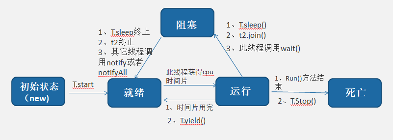

# 线程的生命周期和通讯机制

## 生命周期

###1、yield()方法
- yield()让当前正在运行的线程回到就绪，以允许具有相同优先级的其他线程获得运行的机会。但是，实际中无法保证yield()达到让步的目的，因为，让步的线程可能被线程调度程序再次选中。

- 同时yield()不会放弃锁资源，所以有可能会出现死锁。

###2、wait和sleep方法的区别
- 1）第一个很重要的区别就是，wait方法必须正在同步环境下使用，比如synchronized方法或者同步代码块。如果你不在同步条件下使用，会抛出IllegalMonitorStateException异常。另外，sleep方法不需要再同步条件下调用，你可以任意正常的使用。

- 2）第二个区别是，wait方法用于和定义于Object类的，而sleep方法操作于当前线程，定义在java.lang.Thread类里面。

- 3）第三个区别是，调用wait()的时候方法会释放当前持有的锁，而sleep方法不会释放任何锁。

###3、wait和sleep方法使用场景
-（1）wait方法定义在Object类里面，所有对象都能用到，一般wait()和notify()方法或notifyAll使用于线程间的通信。

-（2）sleep()方法用于暂停当前线程的执行。

###4、join方法（）
- thread.Join把指定的线程加入到当前线程，可以将两个交替执行的线程合并为顺序执行的线程。
- 比如在线程B中调用了线程A的Join()方法，直到线程A执行完毕后，才会继续执行线程B。
###5、stop方法
线程启动完毕后,在运行可能需要终止,Java提供的终止方法只有一个stop,但是不建议使用此方法,因为它有以下三个问题:

- 1)stop方法是过时的。

>从Java编码规则来说,已经过时的方式不建议采用.

- 2)stop方法会导致代码逻辑不完整

>stop方法是一种"恶意" 的中断,一旦执行stop方法,即终止当前正在运行的线程,不管线程逻辑是否完整,这是非常危险的.

- 3)stop方法会破坏原子逻辑

>多线程为了解决共享资源抢占的问题,使用了锁的概念,避免资源不同步,但是正是因为此原因,stop方法却会带来更大的麻烦,它会丢弃所有的锁,导致原子逻辑受损

## 线程通讯
### 1.依次运行用join
### 2.交叉运行用wait()和notify()或者notifyAll()
### 3.四个线程 A B C D，其中 D 要等到 A B C 全执行完毕后才执行，而且 A B C 是同步运行的。
用CountdownLatch,主要方法latch.await(),latch.countDown();
### 4.三个运动员各自准备，等到三个人都准备好后，再一起跑
用CyclicBarrier
### 5.子线程完成某件任务后，把得到的结果回传给主线程
用FutureTask和Callable