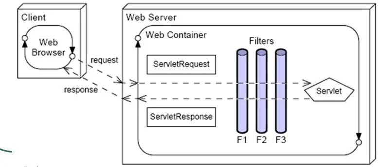

#Filter
- Filter是javax.servlet包中定义的接口，任何实现Filter接口的类都能称为过滤器。
- 主要用途：字符过滤集、控制权限、防止跨站脚本攻击（XSS）等等。
- 实现：
	1. 如果是传统项目，需要在web.xml中配置filter
```java
	  <filter>
        <description>字符集过滤器</description>
        <filter-name>encodingFilter</filter-name>
        <filter-class>org.springframework.web.filter.CharacterEncodingFilter</filter-class>
        <init-param>
            <description>字符集编码</description>
            <param-name>encoding</param-name>
            <param-value>UTF-8</param-value>
        </init-param>
    </filter>

    <filter-mapping>
        <filter-name>encodingFilter</filter-name>
        <url-pattern>/*</url-pattern>
    </filter-mapping>
```

	2. 如果是springBoot项目,可以在定义好自己的filter类之后，需要使用filterRegisterationBean将filter进行注入。
```java
	public class MDCFilter implements Filter {
	    @Override
	    public void init(FilterConfig filterConfig) throws ServletException {
	    }
	    @Override
	    public void doFilter(ServletRequest servletRequest, ServletResponse servletResponse, FilterChain filterChain) throws IOException, ServletException {
	        filterChain.doFilter(servletRequest, servletResponse);
	    }
	    @Override
	    public void destroy() {
	    }
	}

	 @Bean
    public FilterRegistrationBean mdcFilterRegistration() {
        FilterRegistrationBean registration = new FilterRegistrationBean();
        registration.setDispatcherTypes(DispatcherType.REQUEST);
        registration.setFilter(new MDCFilter());
        registration.addUrlPatterns("/*");
        registration.setName("MDCFilter");
        //设置过滤器顺序
        registration.setOrder(Integer.MAX_VALUE);
        return registration;
    }
```

- Filter随着项目的启动而启动，只初始化一次，随着web项目的停止而销毁
- Filter主要包括3个方法init()、doFilter()、destroy();
- Filter调用链



- Filter接口
```java
	public interface Filter {

        // 容器创建的时候调用, 即启动tomcat的时候调用
        public void init(FilterConfig filterConfig) throws ServletException;
    
        // 由FilterChain调用, 并且传入Filter Chain本身
        public void doFilter(ServletRequest request, ServletResponse response,
                FilterChain chain) throws IOException, ServletException;
    
        // 容器销毁的时候调用, 即关闭tomcat的时候调用
        public void destroy();
    }
```

# Interceptor
 
- 拦截器，请求的接口被访问之前，进行拦截然后在之前或之后加入某些操作。拦截是AOP的一种实现策略。 拦截器主要用来按照指定规则拒绝请求。
- 用途：
	- Token令牌验证
	- 请求数据校验
	- 用户权限校验
	- 放行指定接口
- preHandle->handle->postHandle->afterCompletion

	```java
/**
 *Interceptor的源码
 *
 */
public interface HandlerInterceptor {

    // 在调用真正的处理请求类之前调用
    boolean preHandle(HttpServletRequest request, HttpServletResponse response, Object handler)
            throws Exception;

    // 在调用真正的处理请求类之后调用
    void postHandle(
            HttpServletRequest request, HttpServletResponse response, Object handler, ModelAndView modelAndView)
            throws Exception;

    //  在完成渲染或者出错之后调用
    void afterCompletion(
            HttpServletRequest request, HttpServletResponse response, Object handler, Exception ex)
            throws Exception;
}
	```

- 实现
  1. 创建拦截器，实现HandlerInterceptor接口,重写preHandle、postHandle、afterCompletion方法。
	```java
/**
 *
 *创建拦截器
 */
@Component
public class LoginHandlerInterceptor implements HandlerInterceptor {

    //目标方法执行之前
    @Override
    public boolean preHandle(HttpServletRequest request, HttpServletResponse response, Object handler) throws Exception {
		//也可以做权限处理，获取用户权限
        Object user = request.getSession().getAttribute("currentUser");
        if (user == null) {
            //未登录,返回登录页面
            //response.sendRedirect("/LoginError.html");
            //return false;
			//或者返回固定错误码值让前端处理
        }else {
            //放行
            return true;
        }
    }

    @Override
    public void postHandle(HttpServletRequest request, HttpServletResponse response, Object handler, ModelAndView modelAndView) {

    }

    @Override
    public void afterCompletion(HttpServletRequest request, HttpServletResponse response, Object handler, Exception ex) {

    }
}
	```
	2. 创建一个InterceptorConfig实现WebMvcConfigurer来注册拦截器
	
	```java
/**
 *注册拦截器
 */
@Configuration
public class InterceptorConfig implements WebMvcConfigurer {

    @Override
    public void addInterceptors(InterceptorRegistry registry) {
        // 自定义拦截器，添加拦截路径和排除拦截路径
        registry.addInterceptor(new LoginHandlerInterceptor())
				.addPathPatterns("/**")
				.excludePathPatterns("/index.html");
    }
}
	```


# 总结
1. 实现的方式的不同. Filter是利用了方法的调用(入栈出栈)完成整个流程, 而Interceptor是利用了for循环完成了整个流程.
2. filter是servlet容器支持的，interceptor是spring框架支持的。
3. Filter的优先级是高于Interceptor, 即请求是先到Filter再到Interceptor的, 因为Interceptor的实现主体还是一个servlet。
4. filter只在方法前后执行，interceptor粒度更细，可以深入到方法前后，异常抛出前后。
5. Interceptor可以访问Controller上下文、值栈里的对象，而过滤器不能访问。
6. Interceptor只能对Controller请求起作用，而Filter则可以对几乎所有的请求起作用

参考: <https://www.jianshu.com/p/5f5e5211bbdb>
参考: <https://www.cnblogs.com/junzi2099/p/8022058.html>