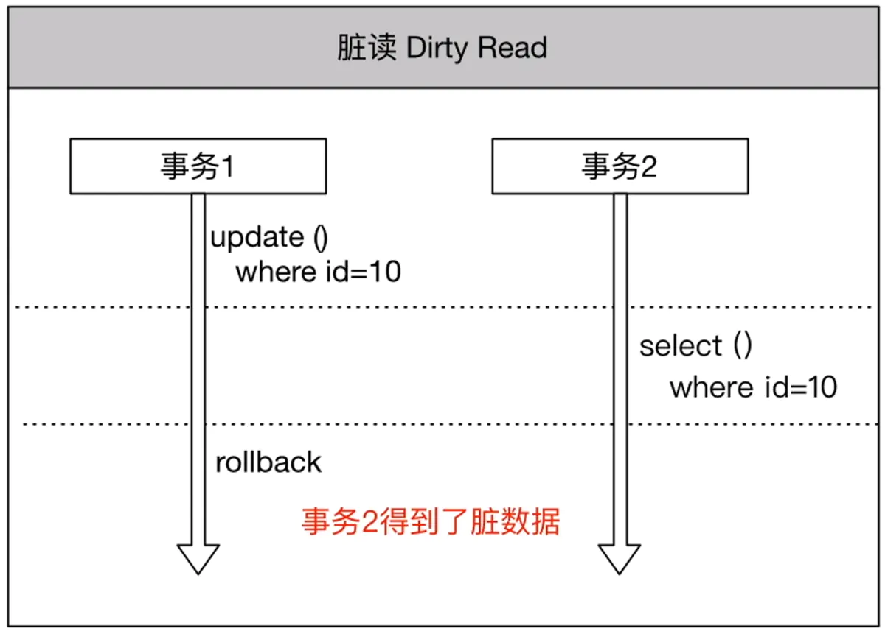
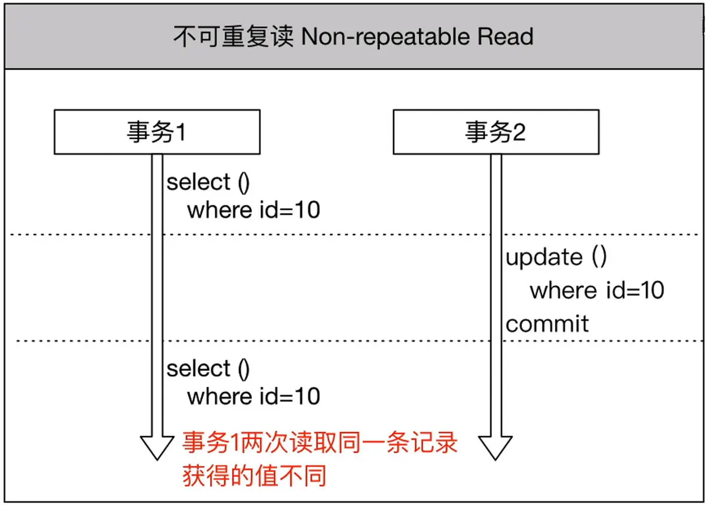
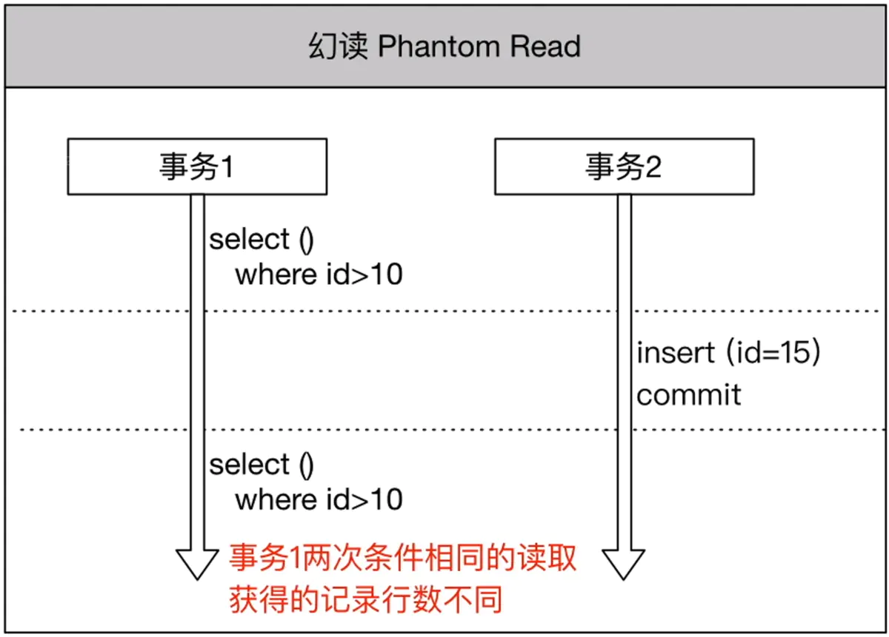
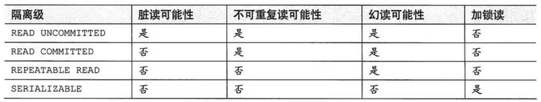
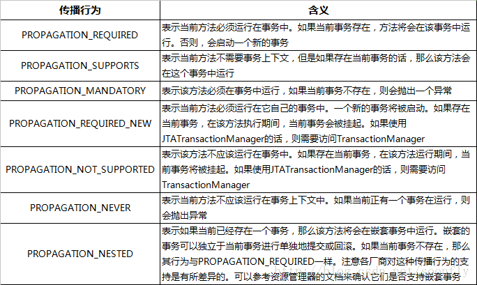

## 简述
在高并发的情况下，MySQL 事务的并发处理会带来几个问题脏读、不可重复读、幻读。由于高并发事务带来这几个问题，所以就产生了事务的隔离级别。

## 事务是什么
- 事务是数据库操作的最小工作单元，用户定义的一系列数据库操作作为一个整体一起向系统提交，要么都执行、要么都不执行。是不可分割的工作单元。
> 如果没做好并发控制，可能会造成**脏读、不可重复读和幻读**等问题。

### **可交叉程度**
- 脏读Dirty Read（看到的数据则是不正确的）
**当一个事务能看见另外一个事务未提交的数据时，就称为脏读。如果这个事务被回滚了而不是提交了，那么其它事务看到的数据则是不正确的，是“脏”的。**

- Non-repeatable Read(不可重复读) 两次读取到的数据不同
**假设事务A读取了一行数据，接下来事务B改变了这行数据，之后事务A再一次读取这行数据，结果就是事务A两次读取到的数据不同。**

- Phantom Read(幻读) 发现多出来一条数据	
**假设事务A通过一个 where 条件读取到了一个结果集，事务B这时插入了一条符合事务A的 where 条件的数据，之后事务A通过同样的 where 条件再次查询时，发现多出来一条数据。**

## 1.事务隔离级别(Isolation)
JDBC 规范增加了隔离级别，来满足了 SQL:2003 定义的 4 种事务隔离级别。
在安装MySQL时，安装默认的隔离级别就是：可重复读。
可以通过 **select @@global.tx_isolation;** 来查看当前隔离级别。
隔离级别从最宽松到最严格，排序如下所示：

**TRANSACTION_NONE(无事务)**
这意味着当前的 JDBC 驱动不支持事务，也意味着这个驱动不符合 JDBC 规范。

- 1.**READ_UNCOMMITTED(读未提交)**
允许事务看到其它事务修改了但未提交的数据，这意味着有可能是**脏读、不可重复读或者、幻读**。

- 2.**READ_COMMITTED(读提交)**
一个事务在未提交之前，所做的修改不会被其它事务所看见。这能**避免脏读**，但避免不了**不可重复读和幻读。**

- 3.**REPEATABLE_READ(可重复读取) **MySQL默认的事务隔离级别
避免了**脏读和不可重复读**，但**幻读**依然是有可能发生的。

- 4.**SERIALIZABLE(序列化)**
避免了脏读、不可重复读以及幻读。

## 2.Propagation事务传播行为
Propagation属性用来枚举事务的传播行为。所谓事务传播行为就是多个事务方法相互调用时，事务如何在这些方法间传播。Spring支持7种事务传播行为，默认为**REQUIRED**。

- 1.REQUIRED
REQUIRED是常用的事务传播行为。如果当前没有事务，就新建一个事务，如果已经存在一个事务中，加入到这个事务中。

- 2.SUPPORTS
SUPPORTS表示当前方法不需要事务上下文，但是如果存在当前事务的话，那么这个方法会在这个事务中运行。

- 3.MANDATORY
MANDATORY表示该方法必须在事务中运行，如果当前事务不存在，则会抛出一个异常。不会主动开启一个事务。

- 4.REQUIRES_NEW
REQUIRES_NEW表示当前方法必须运行在它自己的事务中。一个新的事务将被启动，如果存在当前事务，在该方法执行期间，当前事务会被挂起(如果一个事务已经存在，则先将这个存在的事务挂起)。如果使用JTATransactionManager的话，则需要访问TransactionManager。

- 5.NOT_SUPPORTED
NOT_SUPPORTED表示该方法不应该运行在事务中，如果存在当前事务，在该方法运行期间，当前事务将被挂起。如果使用JTATransactionManager的话，则需要访问TransactionManager。

- 6.NEVER
NEVER表示当前方法不应该运行在事务上下文中，如果当前正有一个事务在运行，则会抛出异常。

- 7.NESTED
NESTED表示如果当前已经存在一个事务，那么该方法将会在嵌套事务中运行。嵌套的事务可以独立于当前事务进行单独地提交或回滚。如果当前事务不存在，那么其行为与REQUIRED一样。嵌套事务一个非常重要的概念就是内层事务依赖于外层事务。外层事务失败时，会回滚内层事务所做的动作。而内层事务操作失败并不会引起外层事务的回滚。

- 8.NESTED和REQUIRED_NEW区别
- 共同点：类似嵌套事务，如果不存在一个外层的事务，都会开启一个新的事务
- 不同点：
	- REQUIRES_NEW：内层事务与外层事务就像两个独立的事务一样，一旦内层事务进行了提交后，外层事务不能对其进行回滚。两个事务互不影响。
	- NESTED：外层事务的回滚可以引起内层事务的回滚。而内层事务的异常并不会导致外层事务的回滚，它是一个真正的嵌套事务。

具体传播行为可参考:
推荐<https://blog.csdn.net/weixin_39625809/article/details/80707695>
<https://www.jianshu.com/p/df67740c1f4c>

## 3.Spring事务的基本原理
- Spring事务的本质其实就是数据库对事务的支持，没有数据库的事务支持，Spring是无法提供事务功能的。对于纯JDBC操作数据库，想要用到事务，可以按照以下步骤进行：
>	1.获取连接 Connection con = DriverManager.getConnection()；
	2.开启事务 con.setAutoCommit(true/false)；
	3.执行 CRUD；
	4.提交事务/回滚事务 con.commit()/con.rollback()；
>	5.关闭连接 con.close()。

使用Spring的事务管理功能后，程序员可以不再写步骤 2 和 4 的代码，而是由 Spirng 自动完成。
Spring是如何CRUD之前和之后开启事务和关闭事务的？解决这个问题，也就可以从整体上理解Spring的事务管理实现原理了。下面简单地介绍下，注解方式为例子：

>配置文件开启注解驱动，在相关的类和方法上通过注解@Transactional标识。
Spring 在启动的时候会去解析生成相关的bean，这时候会查看拥有相关注解的类和方法，并且为这些类和方法生成代理，并根据@Transactional的相关参数进行相关配置注入，这样就在代理中把相关的事务实现了(开启正常提交事务，异常回滚事务)。
>真正的数据库层的事务提交和回滚是通过**binlog和redo log**实现的。

## 2.事务的四大特性【ACID】
> 事务最经典的例子就是转账了。假如小明要给小红转账100元，这个转账会涉及到两个关键操作就是：将小明的余额减少100元，将小红的余额增加100元。万一在这两个操作之间突然出现错误(如银行系统崩溃等)，导致小明余额减少而小红的余额没有增加，这样就不对了。事务就是保证这两个关键操作要么都成功，要么都要失败。
>

- 原子性(atomicity)。一个事务是一个不可分割的工作单位，事务中包括的操作要么都做，要么都不做。
- 一致性(consistency)。事务必须是使数据库从一个一致性状态变到另一个一致性状态。一致性与原子性是密切相关的。
- 隔离性(isolation)。一个事务的执行不能被其他事务干扰。即一个事务内部的操作及使用的数据对并发的其他事务是隔离的，并发执行的各个事务之间不能互相干扰。
- 持久性(durability)。持久性也称永久性(permanence)，指一个事务一旦提交，它对数据库中数据的改变就应该是永久性的。接下来的其他操作或故障不应该对其有任何影响。 

ps.并发的三大特性 参考java/多线程/Volatile.md(原子性、可见性、有序性)
## 3.MVCC
InnoDB基于行锁还实现了MVCC多版本并发控制，MVCC在隔离级别下的**Read committed和Repeatable read**下工作。MVCC能够实现读写不阻塞！

MVCC(Multi-Version Concurrency Control)多版本并发控制，可以简单地认为：MVCC就是行级锁的一个变种(升级版)。

- 事务的隔离级别就是通过**锁的机制来实现**，只不过**隐藏了加锁细节**
- 在**表锁中我们读写是阻塞**的，基于提升并发性能的考虑，**MVCC一般读写是不阻塞的**(所以说MVCC很多情况下避免了加锁的操作)

- MVCC实现的读写不阻塞正如其名：多版本并发控制--->通过一定机制生成一个数据请求**时间点的一致性数据快照（Snapshot)**，并用这个快照来提供一定级别**（语句级或事务级）的一致性读取**。从用户的角度来看，好像是**数据库可以提供同一数据的多个版本。**
- 快照有**两个级别**：
	- 语句级
	针对于Read committed隔离级别
	- 事务级别
	针对于Repeatable read隔离级别

refer to:<https://www.jianshu.com/p/7e76ce65e3ad>
refer to:<https://zhuanlan.zhihu.com/p/81814486>
