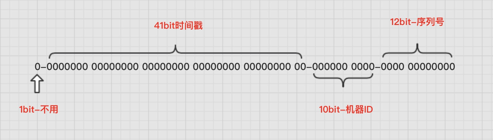

# Java静态内部类实现雪花算法（SnowFlake）

## 前言
在生成表主键时，通常可以考虑自增主键/UUID/雪花算法
- 自增主键：
	- 1.容易被爬虫遍历数据。
	- 2.分库分表可能会有ID冲突。
- UUID
	- 1.太长，有索引碎片
	- 2.无序
- 雪花算法
	- 适合在分布式场景下生成唯一ID，保证唯一可排序

## 原理
SnowFlake算法生成ID的是一个64bit大小的整数。
由于在Java中64bit的整数是long类型,所以在Java中SnowFlake算法生成的id就是long来存储的。
- id结构如下：

0-0000000000 0000000000 0000000000 0000000000 0-00000-00000-000000000000

- 算法描述：
	- **1bit** 因为二进制中最高位是符号位，1表示负数，0表示正数。生成的ID都是正整数，所以最高位固定为0。
	- **41bit-时间戳** 精确到毫秒级，41位的长度可以使用69年。时间位还有一个很重要的作用是可以根据时间进行排序。
    - **10bit**-工作机器id，Twitter实现中使用前5位作为数据中心标识，后5位作为机器标识，可以部署2^10 = 1024个节点；
    - **12bit-序列号** 这个是用来记录同一个毫秒内产生的不同 id。
    >12位（bit）可以表示的最大正整数是2^{12}-1 = 4095，即可以用0、1、2、3、....4094这4095个数字，来表示同一机器同一时间截（毫秒)内产生的4095个ID序号。

## 实现代码
```java
/**
 * 描述: Twitter的分布式自增ID雪花算法snowflake (Java版)
 * 
 **/
public class SnowFlake {

    /**
     * 起始的时间戳
     * 2021-01-01 00:00:00
     */
    private final static long START_STMP = 1609430400000L;

    /**
     * 每一部分占用的位数
     */
    private final static long SEQUENCE_BIT = 12; //序列号占用的位数
    private final static long MACHINE_BIT = 5;   //机器标识占用的位数
    private final static long DATACENTER_BIT = 5;//数据中心占用的位数

    /**
     * 每一部分的最大值
     */
    private final static long MAX_DATACENTER_NUM = -1L ^ (-1L << DATACENTER_BIT);
    private final static long MAX_MACHINE_NUM = -1L ^ (-1L << MACHINE_BIT);
    private final static long MAX_SEQUENCE = -1L ^ (-1L << SEQUENCE_BIT);

    /**
     * 每一部分向左的位移
     */
    private final static long MACHINE_LEFT = SEQUENCE_BIT;
    private final static long DATACENTER_LEFT = SEQUENCE_BIT + MACHINE_BIT;
    private final static long TIMESTMP_LEFT = DATACENTER_LEFT + DATACENTER_BIT;

    private long datacenterId;  //数据中心
    private long machineId;     //机器标识
    private long sequence = 0L; //序列号
    private long lastStmp = -1L;//上一次时间戳

    public SnowFlake(long datacenterId, long machineId) {
        if (datacenterId > MAX_DATACENTER_NUM || datacenterId < 0) {
            throw new IllegalArgumentException("datacenterId can't be greater than MAX_DATACENTER_NUM or less than 0");
        }
        if (machineId > MAX_MACHINE_NUM || machineId < 0) {
            throw new IllegalArgumentException("machineId can't be greater than MAX_MACHINE_NUM or less than 0");
        }
        this.datacenterId = datacenterId;
        this.machineId = machineId;
    }

    /**
     * 产生下一个ID
     *
     * @return
     */
    public synchronized long nextId() {
        long currStmp = getNewstmp();
        if (currStmp < lastStmp) {
            throw new RuntimeException("Clock moved backwards.  Refusing to generate id");
        }

        if (currStmp == lastStmp) {
            //相同毫秒内，序列号自增
            sequence = (sequence + 1) & MAX_SEQUENCE;
            //同一毫秒的序列数已经达到最大
            if (sequence == 0L) {
                currStmp = getNextMill();
            }
        } else {
            //不同毫秒内，序列号置为0
            sequence = 0L;
        }

        lastStmp = currStmp;

        return (currStmp - START_STMP) << TIMESTMP_LEFT //时间戳部分
                | datacenterId << DATACENTER_LEFT       //数据中心部分
                | machineId << MACHINE_LEFT             //机器标识部分
                | sequence;                             //序列号部分
    }

    private long getNextMill() {
        long mill = getNewstmp();
        while (mill <= lastStmp) {
            mill = getNewstmp();
        }
        return mill;
    }

    private long getNewstmp() {
        return System.currentTimeMillis();
    }

    public static void main(String[] args) {
        SnowFlake snowFlake = new SnowFlake(2, 3);

        long start = System.currentTimeMillis();
        for (int i = 0; i < 1000000; i++) {
            System.out.println(snowFlake.nextId());
        }

        System.out.println(System.currentTimeMillis() - start);


    }
}
```

参考：<https://www.cnblogs.com/qdhxhz/p/11372658.html>