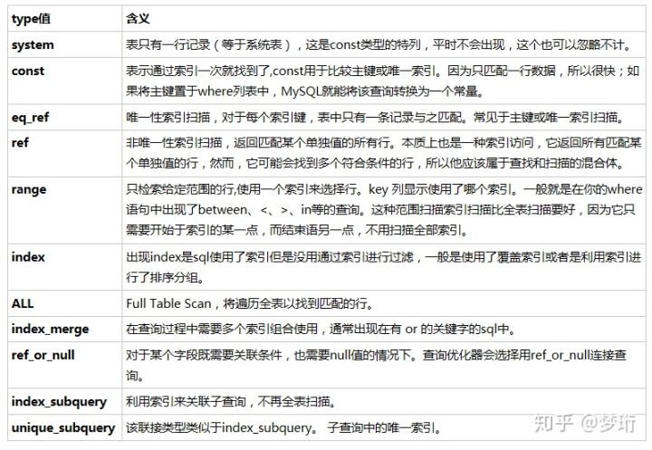

# Explain
## Explain 列

```sql
mysql> explain select * from users where userid=1;
+----+-------------+-------+------------+-------+---------------+---------+---------+-------+------+----------+-------+
| id | select_type | table | partitions | type  | possible_keys | key     | key_len | ref   | rows | filtered | Extra |
+----+-------------+-------+------------+-------+---------------+---------+---------+-------+------+----------+-------+
|  1 | SIMPLE      | users | NULL       | const | PRIMARY       | PRIMARY | 8       | const |    1 |   100.00 | NULL  |
+----+-------------+-------+------------+-------+---------------+---------+---------+-------+------+----------+-------+
1 row in set, 1 warning (0.00 sec)
```

- 1.select_type 表示查询类型，分为简单查询(SIMPLE)和复杂查询(PRIMARY)，复杂查询又分为三类：简单子查询、派生表（from语句中的子查询）、union 查询。

- 2.type列(非常重要)
- 表示MySQL**在表中找到所需行的方式**，又称“访问类型”

- 依次从最优到最差分别为：**system > const > eq_ref > ref**> fulltext > ref_or_null > index_merge > unique_subquery > index_subquery> **range > index > ALL**

- ★注意：一般来说，得保证查询至少达到range级别，最好能达到ref。
 


- 3.possible_keys列
指出MySQL能使用哪个索引在表中找到记录，查询涉及到的字段上若存在索引，则该索引将被列出，但不一定被查询使用

- 4.key列(非常重要)
**key列显示MySQL实际决定使用的键（索引)**

如果没有选择索引，键是NULL。要想强制MySQL使用或忽视possible_keys列中的索引，在查询中使用FORCE INDEX、USE INDEX或者IGNORE INDEX
