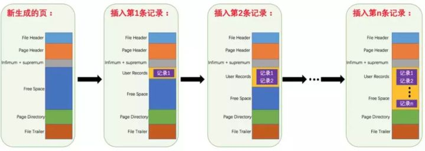

# MySql索引
1.基础
- 首先Mysql的基本存储结构是页(记录都存在页里边)：

- 各个数据页可以组成一个双向链表
- 而每个数据页中的记录又可以组成一个单向链表
- 每个数据页都会为存储在它里边儿的记录生成**一个页目录**，在通过**主键查找某条记录的时候可以在页目录中使用二分法快速定位到对应的槽**，然后再遍历该槽对应分组中的记录即可快速找到指定的记录
- 总结就是：**使用二分查找算法从页目录中快速定位记录。**
- 以其他列(非主键)作为搜索条件：只能从最小记录开始依次遍历单链表中的每条记录。

- 所以说，如果我们写select * from user where username = 'Java3y'这样没有进行任何优化的sql语句，默认会这样做：
- 定位到记录所在的页
- 1.需要遍历双向链表，找到所在的页
- 2.从所在的页内中查找相应的记录
- 3.由于不是根据主键查询，只能遍历所在页的单链表了
总结就是：**遍历双向链表定位页，遍历所在页的单链表定位数据。**
- **很明显，在数据量很大的情况下这样查找会很慢！**

2.索引提高检索速度
- 一般经常需要搜索、排序、WHERE的列上加上索引，可以加快对应操作的速度。
- 索引将无序的数据变成有序(相对)：
- 很明显的是：**没有用索引我们是需要遍历双向链表来定位对应的页，有索引可以通过**“目录”**就可以很快地定位到对应的页上了！**
- 其实底层结构就是B+树，B+树作为树的一种实现，能够让我们很快地查找出对应的记录。

3.索引降低增删改的速度
- B+树是平衡树的一种。
>平衡树：它是一棵空树或它的左右两个子树的高度差的绝对值不超过1，并且左右两个子树都是一棵平衡二叉树。

- 如果一棵普通的树在极端的情况下，是能退化成链表的(树的优点就不复存在了)
- 检索的时间复杂度就是O(logn)
- **B+树是一颗平衡树，如果我们对这颗树增删改的话，那肯定会破坏它的原有结构。**
- **要维持平衡树，就必须做额外的工作。正因为这些额外的工作开销，导致索引会降低增删改的速度**

4.聚簇和非聚簇索引
简单概括：
- 聚簇索引就是以主键创建的索引，检索效率比非聚簇索引高，但对数据更新影响较大。
- 非聚簇索引就是以非主键创建的索引，非聚簇索引检索效率比聚集索引低，但对数据更新影响较小。
>非聚集索引表示数据存储在一个地方，索引存储在另一个地方，索引带有指针指向数据的存储位置。

区别：

- **聚簇索引在叶子节点存储的是表中的数据**
- **非聚簇索引在叶子节点存储的是主键值**
- 使用非聚簇索引查询出数据时，**拿到叶子上的主键再去查到想要查找的数据。(拿到主键再查找这个过程叫做回表)**
- **非聚集索引也叫做二级索引**

5.索引最左匹配原则
- 索引可以简单如一个列(a)，也可以复杂如多个列(a, b, c, d)，即联合索引。
- 如果是联合索引，那么key也由多个列组成，同时，索引只能用于查找key是否存在（相等），遇到范围查询(>、<、between、like左匹配(%As))等就不能进一步匹配了，后续退化为线性查找。
- 因此，列的排列顺序决定了可命中索引的列数。
>如有索引(a, b, c, d)，查询条件a = 1 and b = 2 and c > 3 and d = 4，则会在每个节点依次命中a、b、c，无法命中d。(很简单：索引命中只能是相等的情况，不能是范围匹配)
- 通过a,c条件查询能不能使用或命中这个索引？-----能
- 通过b,c条件查询能不能使用或命中这个索引？-----不能

6.=、in自动优化顺序
不需要考虑=、in等的顺序，mysql会自动优化这些条件的顺序，以匹配尽可能多的索引列。
>如有索引(a, b, c, d)，查询条件c > 3 and b = 2 and a = 1 and d < 4与a = 1 and c > 3 and b = 2 and d < 4等顺序都是可以的，MySQL会自动优化为a = 1 and b = 2 and c > 3 and d < 4，依次命中a、b、c。

7.总结
1，**最左前缀匹配原则。**这是非常重要、非常重要、非常重要（重要的事情说三遍）的原则，MySQL会一直向右匹配直到遇到范围查询（>,<,BETWEEN,LIKE（左%））就停止匹配。
2，**尽量选择区分度高的列 OR 经常要作为查询条件的字段 作为索引**，区分度的公式是 COUNT(DISTINCT col) / COUNT(\*)。表示字段不重复的比率，比率越大我们扫描的记录数就越少。
3，**索引列不能参与计算，尽量保持列“干净”**。比如，FROM_UNIXTIME(create_time) = '2016-06-06' 就不能使用索引，原因很简单，B+树中存储的都是数据表中的字段值，但是进行检索时，需要把所有元素都应用函数才能比较，显然这样的代价太大。所以语句要写成 ： create_time = UNIX_TIMESTAMP('2016-06-06')。
4，**尽可能的扩展索引，不要新建立索引。** 比如表中已经有了a的索引，现在要加（a,b）的索引，那么只需要修改原来的索引即可。
5，**单个多列组合索引和多个单列索引的检索查询效果不同，因为在执行SQL时，MySQL只能使用一个索引，会从多个单列索引中选择一个限制最为严格的索引。**
6，索引类型 普通索引、唯一索引、主键索引、组合索引、全文索引等待

## 为什么用 B+ 树做索引而不用哈希表做索引
1.哈希不支持范围查找，只能遍历全表。
2.哈希表不支持模糊查找，B+Tree采用最左匹配原则，支持模糊查找
3.哈希code存在重复情况

